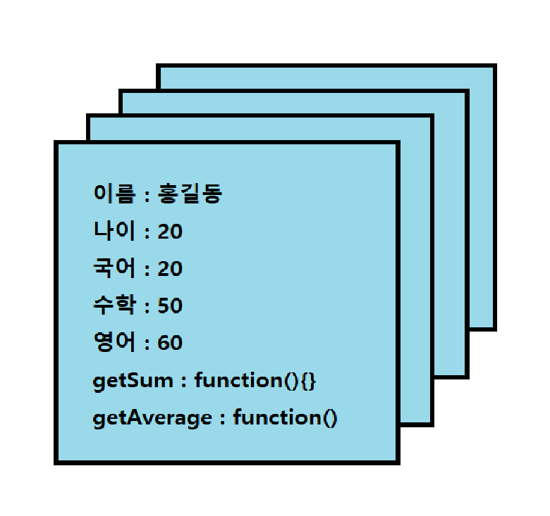
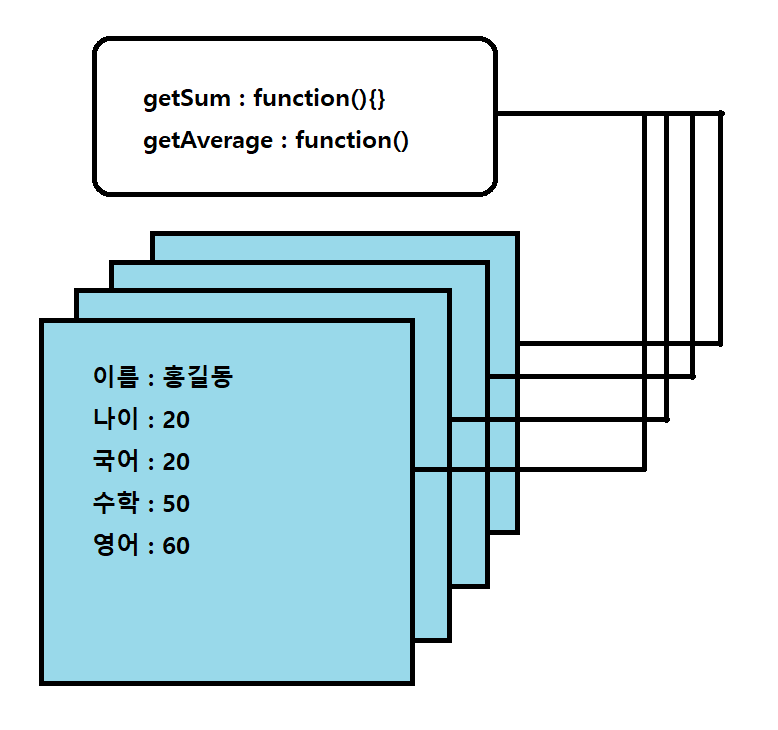

> __2021-11-24__ <br/>
> # __`생성자 함수`__
<br>

## 1. 생성자 함수 개요
```javascript
function Student(){

}
var student = new Student();
```
student는 객체 또는 인스턴스,
Student는 생성자함수라고 부른다.

<br><br>

 __NOTE.__
Instanceof 키워드<br>
Student 생성자 함수로 student 객체를 생성할때, 생성자 함수로 만들어진 객체를 인스턴스라고 부른다고했다.<br>
이 객체가 어떠한 생성자 함수로 생성됐는지 확인할 때는 instanceof 키워드를 사용하여 확인한다.<br>
```javascript
function Student(){

}
var student = new Student();
console.log(student instanceof Student);
console.log(student instanceof Number);
console.log(student instanceof String);

/*
true
false
false
*/
```

<br><br>

## 2. 프로토타입

| 객체구조 | 프로토타입을 사용한 객체구조 |
|:-------:|:--------------------------:|
|||

기존 객체 구조는 모든 객체가 다른 값을 가지지만 메서드는 모두 다른 값을 갖는다. 각 객체를 생성할 때마다 동일한 함수를 계속 생성한다는 것이다. 만약 데이터를 1000개를 만든다고 한다면 그 동일한 함수도 1000개를 만들어야 한다는 것이다. 메모리를 쓸데없이 낭비해서 매우 비효울적이다. 그 문제를 해결하기위해 프로토타입이라는걸 사용하면된다. 각 객체마다 가진 메서드를 프로토타입이라는 공간으로 옮기면 메서드를 하나만 생성해도 모든 객체가 해당 메서드를 사용할 수 있다. 따라서 생성자함수를 객체로 만들때 생성자 함수 내부에 속성만 넣으면된다.
```javascript
function Student(name, korean, math, english, science){
    this.이름 = name;
    this.국어 = korean;
    this.수학 = math;
    this.영어 = english;
    this.과학 = science;

    Student.prototype.getSum = function(){};
    Student.prototype.getAverage = function(){};
    Student.prototype.toString = function(){};
}
```

<br><br>

## 3. 캡슐화
```javascript
function Rectangle(){
    var width = 0;
    var height = 0;

    this.getWidth = function(){return width;};
    this.getHeight = function(){return height;};
    this.setWidth = function(w){
        if(w < 0){
            alert("width에는 음수를 넣을 수 없습니다.");
            return;    
        }else{
            width = w;
        }
    };
    this.setHeight = function(h){
        if(h < 0){
            alert("height에는 음수를 넣을 수 없습니다.");
        }else{
            height = h;
        }
    };
    Rectangle.prototype.getArea = function(){
        return this.getWidth() * this.getHeight();
    }
}

var rectangle = new Rectangle();
rectangle.setWidth(-2);

rectangle.setWidth(2);
rectangle.setHeight(2);

console.log(rectangle.getArea());
```
사각형의 넓이를 구하는 객체이다. 이 객체에 음수값을 넣으면 오류는 나지 않겠지만 넓이의 값은 달라질것이다. 사용자가 음수를 넣지 못하도록 막는 기술을 캡슐화라고 한다. getter와 setter가 있다고 캡슐화가 아니며 캡슐화는 만일의 상황을 대비하여 특정 속성이나 메서드를 사용자가 사용할 수 없게 숨겨놓는것이다.

<br><br>

## 4. 상속
```javascript
// 생성자 함수를 선언합니다.
function Rectangle(w, h){
  var width = w;
  var height = h;

  this.getWidth = function(){ return w; };
  this.getHeight = function(){ return h; };
  this.setWidth = function(w){
      if(w < 0){
          alert("길이는 음수 일 수 없습니다.");
      }else{
          width = w;
      }
  };
  this.setHeight = function(h){
      if(h < 0){
          alert("높이는 음수 일 수 없습니다.");
      }else{
          height = h;
      }
  };
}

// 프로토타입을 추가해준다.
Rectangle.prototype.getArea = function(){
  return this.getWidth() * this.getHeight();
}


// 생성자 함수를 선언합니다.
function Square(length){
  this.base = Rectangle;
  this.base(length, length);
}

// Square 생성자 프로토타입에 Rectangle 프로토타입을 넣는다.
Square.prototype = Rectangle.prototype;
Square.prototype.constructor = Square;

// 변수를 선언합니다.
var rectangle = new Rectangle(5, 2);
var square = new Square(5);
console.log(rectangle.getArea() + " : " + square.getArea());

/*
10 : 25
*/
```
